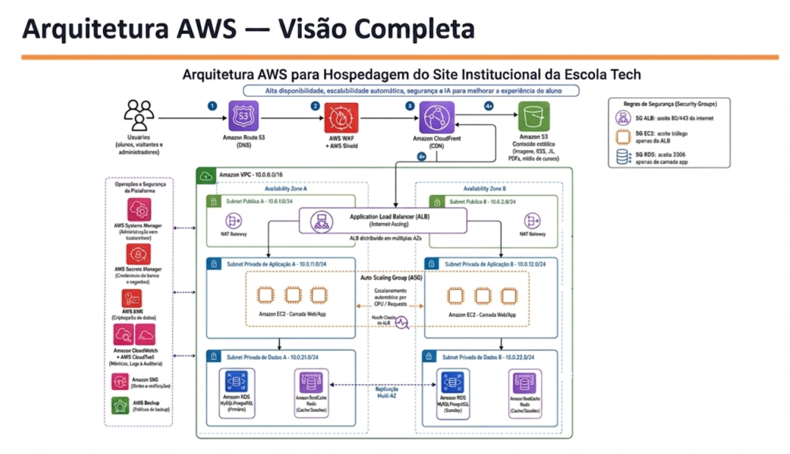
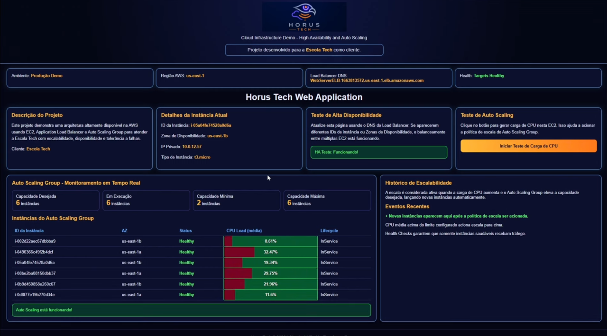
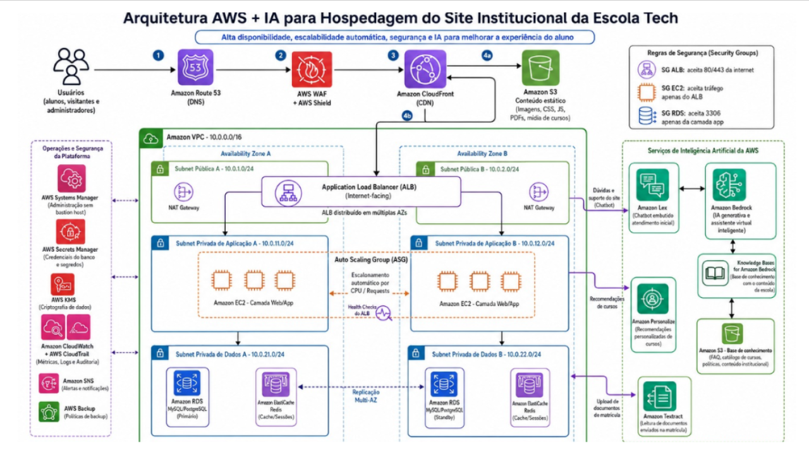

# EscolaTech Project — Scalable Web Hosting on AWS


## Overview

This project was developed as part of the **AWS re/Start program**, in partnership with **Escola da Nuvem**.

The goal was to design and implement a scalable, resilient, secure, and cost-optimized AWS architecture for **Escola Tech**, a fictional online education platform.

The platform needed to remain available and responsive during high-traffic periods such as enrollment campaigns, exams, and grade releases.

This repository is my personal portfolio version of a collaborative team project developed by **Hórus Tech**, with a focus on my contributions as a Developer.

---

## Business Problem

Escola Tech was originally running its platform on a traditional on-premises environment with limited scalability and availability.

During periods of high demand, the platform could face:

- Slow response times;
- Service interruptions;
- Limited capacity to handle traffic peaks;
- Manual infrastructure management;
- Higher operational and maintenance costs;
- Reduced visibility into infrastructure performance.

For an online education platform, downtime during enrollment periods, exams, or grade publication can directly impact students, instructors, and administrative teams.

---

## Proposed Cloud Solution

To address these challenges, our team designed an AWS-based architecture focused on:

- High availability;
- Automatic scalability;
- Load balancing;
- Infrastructure automation;
- Network security;
- Monitoring and observability;
- Cost optimization.

The core implementation uses **Terraform** to provision AWS resources and deploy a web application running on **Amazon EC2**, behind an **Application Load Balancer**, with automatic scaling through an **Auto Scaling Group**.

---

## Web Application

The project includes a web application created to demonstrate the proposed cloud infrastructure and validate high availability and auto scaling behavior.


---

## Implemented Architecture

The implemented version of the project focused on the core infrastructure required to host and scale the application.

### Main Components

| Area | AWS Services / Tools |
|---|---|
| Infrastructure as Code | Terraform |
| Compute | Amazon EC2 |
| Load Balancing | Application Load Balancer |
| Scalability | Auto Scaling Group |
| Networking | Amazon VPC, Subnets, Route Tables, Internet Gateway |
| Security | Security Groups |
| Monitoring | Amazon CloudWatch |
| Automation | User Data Shell Script |
| Web Server | Apache HTTP Server |
| Version Control | Git and GitHub |

---

## Architecture Diagram

The following diagram represents the complete architecture vision proposed for Escola Tech, including the implemented core infrastructure and additional services recommended for future improvements.



---

## My Role

I worked as a **Developer** on the Hórus Tech team.

My role involved supporting the implementation, testing, validation, documentation, and presentation of the proposed AWS solution.

---

## My Contributions

My main contributions included:

- Supporting the implementation of AWS infrastructure using Terraform;
- Contributing to the deployment and validation of the web application on Amazon EC2;
- Helping configure and test the Application Load Balancer;
- Supporting the validation of the EC2 Auto Scaling Group;
- Simulating traffic to demonstrate elasticity and automatic scaling behavior;
- Monitoring infrastructure behavior with Amazon CloudWatch;
- Supporting the technical documentation of the architecture;
- Contributing to the final project presentation;
- Explaining the technical and business benefits of the proposed cloud solution;
- Collaborating with the team to align the architecture with AWS Well-Architected Framework principles.

This project helped me strengthen my hands-on experience with AWS, infrastructure as code, high availability, scalability, monitoring, and FinOps.

---

## Stress Test and Auto Scaling Validation

A stress test was performed to validate the elasticity of the environment.

During the test, simulated CPU load increased demand on the EC2 instances. The Auto Scaling Group responded by launching additional instances automatically to support the increased workload.

This demonstrated how the architecture can help maintain availability and performance during traffic peaks.



### Stress Test Demo Video

The video below demonstrates the stress test and the Auto Scaling behavior during the project validation.

[](./assets/videos/stress-test-demo.mp4)

---

## How the Architecture Works

The application flow can be summarized as follows:

1. Users access the Escola Tech web application through the internet.
2. The Application Load Balancer receives incoming traffic.
3. The Load Balancer distributes requests across healthy EC2 instances.
4. The Auto Scaling Group monitors demand and adjusts the number of instances when needed.
5. Amazon CloudWatch provides monitoring data to support infrastructure visibility.
6. Terraform is used to provision and manage the infrastructure in a repeatable way.

This design improves reliability, scalability, and operational efficiency compared to a traditional on-premises environment.

---

## Cost Optimization Strategy

The solution was designed with cost optimization in mind.

Instead of maintaining fixed infrastructure capacity at all times, the architecture uses automatic scaling to adjust resources based on demand.

This approach helps:

- Reduce unnecessary resource usage during low-traffic periods;
- Support high availability during peak demand;
- Improve cost predictability;
- Apply FinOps principles to cloud infrastructure planning.

---

## Future Architecture Improvements

The project also included recommendations for future enhancements to improve performance, security, data resilience, and user experience.



Recommended improvements include:

- **Amazon Route 53** for DNS management;
- **Amazon CloudFront** for global content delivery;
- **Amazon S3** for static assets such as images, documents, and media files;
- **AWS WAF** for web application protection;
- **AWS Shield** for DDoS protection;
- **Amazon RDS Multi-AZ** for database resilience;
- **Amazon ElastiCache** for caching and session performance;
- **AWS Secrets Manager** for secure credential management;
- **AWS Systems Manager** for operational management;
- **AWS KMS** for encryption key management;
- **Amazon SNS** for alerts and notifications;
- **AWS Backup** for backup policies;
- **Amazon Bedrock** for AI-powered assistant capabilities;
- **Amazon Lex** for chatbot interaction;
- **Amazon Textract** for document processing automation;
- **Amazon Personalize** for course recommendation features.

These improvements were proposed as part of a broader cloud modernization strategy for the platform.

---

## AWS Well-Architected Framework Alignment

The solution was designed considering key pillars of the AWS Well-Architected Framework.

### Operational Excellence

Terraform and documentation support repeatability, automation, and easier infrastructure management.

### Security

Security Groups and network segmentation help control access and reduce unnecessary exposure.

### Reliability

Load balancing, health checks, and auto scaling improve the availability and resilience of the platform.

### Performance Efficiency

The architecture can adapt to changes in demand by scaling compute capacity automatically.

### Cost Optimization

Auto Scaling helps reduce overprovisioning by adjusting resources according to actual usage.

---

## Repository Structure

```bash
.
├── README.md
├── main.tf
├── userdata.sh
├── .gitignore
├── assets/
│   ├── images/
│   │   ├── horus-banner.png
│   │   ├── web-application.png
│   │   ├── stress-test-dashboard.png
│   │   ├── architecture-diagram.png
│   │   └── aws-architecture-full.png
│   └── videos/
│       └── stress-test-demo.mp4
└── docs/
    ├── architecture.md
    ├── my-contributions.md
    ├── stress-test.md
    ├── cost-optimization.md
    └── future-improvements.md
```

---

## Explore the Project

- [Architecture Overview](./docs/architecture.md)
- [My Contributions](./docs/my-contributions.md)
- [Stress Test and Auto Scaling Validation](./docs/stress-test.md)
- [Cost Optimization Strategy](./docs/cost-optimization.md)
- [Future Improvement Recommendations](./docs/future-improvements.md)

---

## Key Skills Demonstrated

- AWS Cloud Architecture
- Infrastructure as Code
- Terraform
- Amazon EC2
- Application Load Balancer
- Auto Scaling Group
- Amazon VPC
- Security Groups
- Amazon CloudWatch
- High Availability
- Scalability and Elasticity
- Monitoring and Observability
- Cost Optimization
- FinOps
- Technical Documentation
- Team Collaboration
- Business-oriented Cloud Solution Design

---

## Important Note

This project was created for educational purposes as part of the AWS re/Start program.

Some AWS resources may generate costs if deployed. Always review the Terraform configuration before running it and destroy the infrastructure after testing.

```bash
terraform destroy
```

---

## Project Team

This project was developed collaboratively by the Hórus Tech team.

| Name | Role |
|---|---|
| Haroldo | Technical Lead |
| Marcelo | Architect |
| Caroline | Developer |
| Denise | Developer |
| Jessica | Developer |
| Mirele | Scrum Master |

---

## Author

**Denise Gomes Paulo**  
AWS Certified Cloud Practitioner | AWS re/Start Graduate | Cloud and Data Analytics Enthusiast

[LinkedIn](https://www.linkedin.com/in/denisengdados/)  
[GitHub](https://github.com/denisegpaulo)
